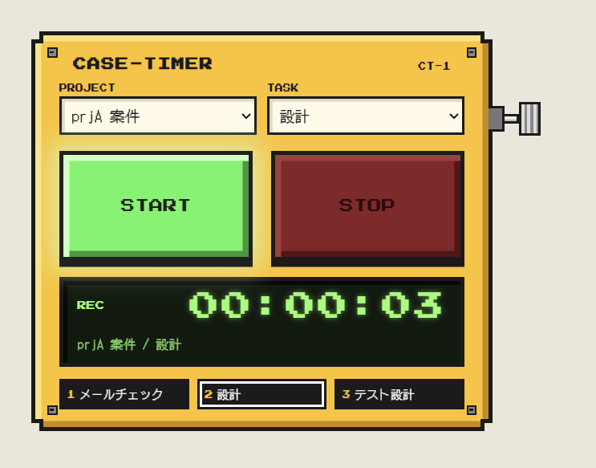
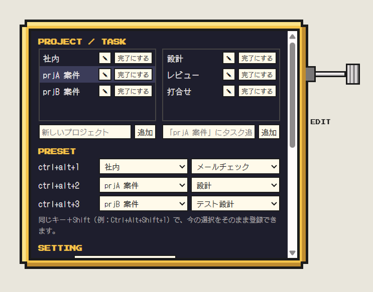
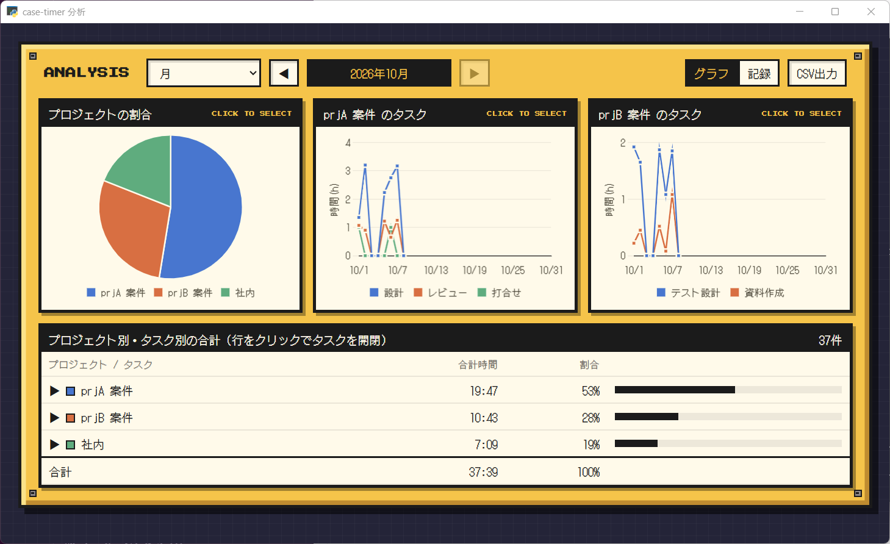

# case-timer


案件（プロジェクト）とタスクごとの作業時間を記録する、Windows用のタイマーアプリです。
画面の最前面に小さく置いておき、START / STOP を押すだけで記録できます。見た目は8bitゲーム風・ギターエフェクター風です。



> [!NOTE]
> 業務用のPCに入れる場合は、事前に社内の情報システム担当に確認してください。

## インストール
1. [Releases](https://github.com/IbushiGinjiro/case-timer/releases) から `case-timer-setup-1.0.0.exe` をダウンロードして実行します。
2. 「WindowsによってPCが保護されました」と表示された場合は、［詳細情報］→［実行］で進めてください（署名をしていないアプリのため表示されます）。
3. インストール中に「PCの起動時に自動で立ち上げる」「デスクトップにショートカットを作る」を選べます。

- インストール先：`%LOCALAPPDATA%\Programs\case-timer`（管理者権限は不要です）
- 動作環境：Windows 10 / 11（画面表示に Microsoft Edge WebView2 を使います。Windows 11 と、更新済みの Windows 10 には最初から入っています）
- 新しい版は、インストーラーを上から実行すれば入れ替わります。記録はそのまま引き継がれます。
- アンインストールは「設定 → アプリ」から行います。記録のデータは消えずに残ります。

## 使い方
初めて起動すると編集モードが開くので、プロジェクトとタスクを登録してください。

| 操作 | 内容 |
|---|---|
| START | 計測開始。計測中にもう一度押すと一時停止／再開。選択を変えてから押すと切替（STOP不要） |
| STOP | 記録して0に戻す |
| Ctrl+Alt+1〜3 | プリセットに切り替えて計測開始 |
| Ctrl+Alt+Shift+1〜3 | 今の選択をプリセットに登録 |
| Ctrl+Alt+0 | 編集モードの開閉 |
| 右側のねじを右へ引く | 編集モード（プロジェクト・タスクの追加／名前変更／完了、プリセット、設定、アプリの終了） |
| ねじを右へ引いて下げる | 分析画面 |
| 時間表示をダブルクリック | ミニモード（細いバー表示・半透明。もう一度ダブルクリックで戻る） |
| CASE-TIMER の文字をドラッグ | ウィンドウの移動（ミニモードでは名前の部分） |

そのほか、次のような動きをします。
- 一定時間（既定15分）PCを操作しなかったときや、スリープから戻ったときは、その間を記録から外すか確認します。
- 日付をまたいだ記録は、0時で分けて保存します。
- 計測中にPCが落ちた場合は、次に起動したときに、最後に動いていた時刻までを記録するか確認します。

| 編集モード | 分析画面 |
|---|---|
|  |  |

分析画面では、表示範囲（週・月・3か月・半年・年・累積）を切り替えて、プロジェクトの割合とタスクごとの推移を見られます。記録の修正・手動追加・CSV出力もここから行えます。

## データの置き場所
- 記録：`ドキュメント\作業時間記録\case-timer.db`（OneDrive を使っている場合は OneDrive 側のドキュメント）。編集モードの「保存先」で変更できます
- 保存先の設定：`%APPDATA%\case-timer\config.json`
- 記録はすべてこのPCの中（または選んだフォルダ）にだけ保存されます。外部への送信はしません
- 同じ記録ファイルを2台のPCから同時に開くと壊れることがあるので、1台で使ってください

## 開発
Python 3.13 / pywebview（WebView2）/ SQLite。仕様と経緯は `SPEC.md`・`PLAN.md`・`TODO.md`・`KNOWLEDGE.md` にあります。

```
pip install -r requirements.txt
python run.py            # 起動（--debug で開発者ツール）
python -m pytest -q      # テスト
python build.py          # exe（dist/）とインストーラー（release/）を作る。Inno Setup 6 が必要
```

動作確認のときは、環境変数 `CASE_TIMER_DATA_DIR` で記録の保存先をテスト用のフォルダに差し替えられます。
バージョンを上げるときは `app/__init__.py`・`installer/version_info.txt`・`installer/case-timer.iss` をそろえます（`build.py` が食い違いを検出します）。

## 同梱物のライセンス
- Chart.js 4.5.1（MIT）：`web/vendor/`
- DotGothic16 / Press Start 2P（SIL Open Font License 1.1）：`web/fonts/`
